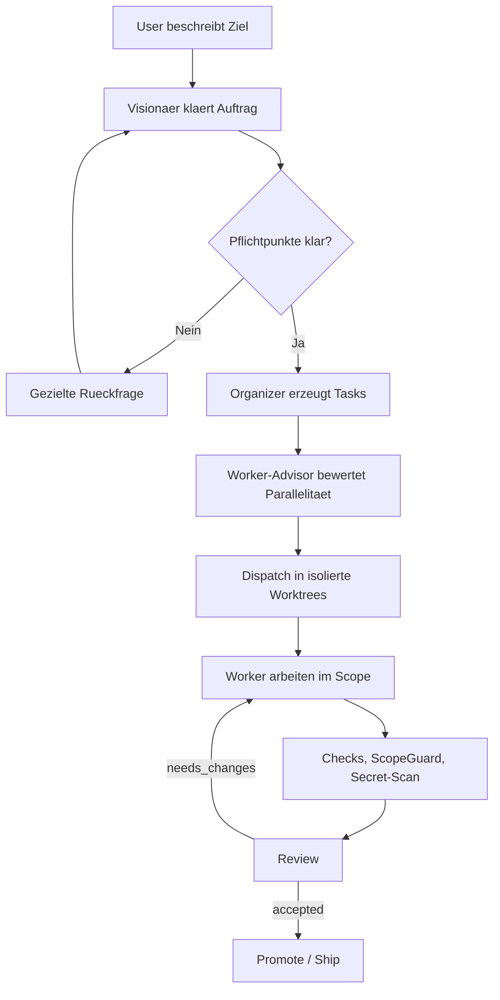

# VOCR

VOCR ist ein lokaler Python-MVP fuer **Vision / Organize / Code / Review**.
Der normale Einstieg ist der gefuehrte **Normalmode**: VOCR klaert ein Ziel,
plant reviewbare Tasks, nutzt Scope-Claims fuer sichere Parallelitaet, bereitet
isolierte Worktrees vor und promotet Aenderungen erst nach akzeptiertem Review.

VOCR ist architektonisch von [VOIT](https://github.com/yesitsfebreeze/voit)
inspiriert, ist aber eine eigenstaendige Python/Codex-Umsetzung. Es ist kein
Fork und enthaelt keinen vendored VOIT-Code.

## Quickstart

Windows:

```powershell
powershell -ExecutionPolicy Bypass -File .\install-vocr.ps1 -Tests -NoStart
.\start-vocr.ps1
```

Der Installer legt `.venv` an, installiert VOCR editable, bootstrapped das Repo
und schreibt die Windows-Startskripte. Fehlendes Git oder Python 3.11+ wird
erkannt; wenn `winget` verfuegbar ist, fragt der Installer nach und kann die
Voraussetzungen automatisch installieren.

Unbeaufsichtigtes Setup:

```powershell
powershell -ExecutionPolicy Bypass -File .\install-vocr.ps1 -Tests -NoStart -AutoYes
```

Manueller Fallback:

```powershell
python -m venv .venv
.\.venv\Scripts\Activate.ps1
pip install -e .
vocr bootstrap --write-scripts --tests
vocr start
```

Details: [docs/INSTALLATION.md](docs/INSTALLATION.md)

## Normalmode

```powershell
vocr start
```

`vocr start` oeffnet die lokale Normalmode-Oberflaeche. Falls kein Fenster
moeglich ist:

```powershell
vocr start --console
```

Login und Keys werden nicht beim Programmstart erzwungen. Nutze im Normalmode
`Optionen`:

- `ChatGPT/Codex Login oeffnen`
- `ChatGPT/Codex Login-Status aktualisieren`
- `Codex/OpenAI API-Key setzen` fuer Expert-Setups
- `LM Studio API-Key setzen`
- `LM Studio Erreichbarkeit pruefen`

LM-Studio-Keys werden aus der Repo-`.env` gelesen und sollen bei Patches nicht
ueberschrieben werden.

Riskantere Session ohne einzelne interne Worker-Permission-Nachfragen:

```powershell
vocr start --dangerously-skip-permissions
```

Das gilt nur fuer diese Session. Review, ScopeGuard, Secret-Scan und Promote
bleiben aktiv; es ist kein Auto-Merge.

## Beta-Test Im Normalmode

Der Reiter `Beta-Test` ist der aktuelle Standardweg fuer Regressionen. Er ist
vertikal scrollbar und in vier Abschnitte gegliedert:

- **Was testen?**: `Ganze Testkette` (Default; gestaffelter Core-Lauf --
  Smoke, Safety, Workflow/Parallelitaet/Memory, Local-Assist-Mocks) oder
  `Einzelnes Szenario / Auswahl` (Tier-Dropdown, Szenario-Dropdown mit
  Info-Panel oder freies Szenarien-Feld, z. B. `S03,S07`).
- **Wie ausfuehren?**: Pause-Verhalten `Nie` (Default, laeuft durch) /
  `Nur bei Cloud-Szenarien` (sinnvoll fuer laengere Laeufe -- die 20+
  Core-Mocks sind in Millisekunden durch, nur echte Cloud-Aufrufe kosten
  Kontingent und verdienen eine Pause) / `Nach jedem Szenario`; dazu Tier,
  Szenarien-Feld, Szenario-Dropdown (zeigt Tier/Haerte/Kosten/Prueft/Nutzen;
  Kosten "kostet Kontingent" ist farblich hervorgehoben), Report-Ordner,
  Tag, Max Cloud Tasks und die Checkboxen fuer Cloud/JSON-only/Debug/
  Codex-Sandbox.
- **Steuerung**: genau drei Buttons -- `Start` startet den gewaehlten Modus,
  `Weiter` ist nur waehrend einer Pause aktiv und zeigt wobei pausiert wurde
  (z. B. "Weiter (nach C01)"), `Stop` bricht sauber nach dem laufenden
  Szenario ab (kein Kill mitten im Lauf).
- **Weitere Funktionen** (sekundaer): `Update aus Git holen`
  (`git pull --ff-only`, editable install, Bootstrap/Startskripte
  aktualisieren), `Finale lokale Testsequenz starten` (All-in-One-Handoff vor
  Cloud), `Szenarien anzeigen`, `Szenarien erklaeren` (Uebersichtsfenster mit
  Code, Titel, Tier, Haerte, Kosten, Pruef- und Nutzenbeschreibung fuer jedes
  registrierte Szenario).

Die finale lokale Testsequenz umfasst:

- Update/Install-Refresh
- Syntax-Check
- komplette Unit-Tests
- ChatGPT/Codex Login-Status
- LM-Studio-Erreichbarkeit
- empfohlenen Core-Beta-Lauf
- finale gestaffelte Core-Kette
- Local-Live-Szenarien S21/S22 gegen das bereits laufende LM Studio
- optional harte Cloud-E2E-Gates C00/C01/C02/C03/C05/C06

S21/S22 laden, starten oder downloaden kein Modell. Sie pruefen nur `/models`
und eine kleine `/chat/completions`-Anfrage gegen ein bereits sichtbares Modell.
Cloud bleibt opt-in ueber die Cloud-Checkbox. Messfaelle C04/C07 laufen bewusst
einzeln, weil sie Kontingent verbrauchen und Zahlen liefern.

CLI:

```powershell
vocr beta
vocr beta --only S03,S07
vocr beta --only S21,S22 --tier local
vocr beta --only C00,C01,C02,C03,C05,C06 --allow-cloud --max-cloud-tasks 6
vocr beta --tier all --allow-cloud
```

Aktueller gruen verifizierter Handoff:
[docs/beta/sessions/2026-07-16-jeenz-normalmode.md](docs/beta/sessions/2026-07-16-jeenz-normalmode.md)

Naechste Testzyklen:
[docs/BETA_TEST_CYCLES_L_C_S.md](docs/BETA_TEST_CYCLES_L_C_S.md)

## Ablauf



Der Visionaer startet keine Planung, solange Ziel, Arbeitsbereich,
Akzeptanzkriterien, Verifikation, Nicht-Ziele oder Ausfuehrungsgrenzen unklar
sind. Im Normalmode sieht der User keine technischen Clarification-IDs.

## Parallelitaet

VOCR kann Worker parallel vorbereiten und ausfuehren, wenn Scope-Claims keine
Konflikte zeigen. Der Visionaer zeigt Worker-Optionen mit grobem Speedup,
Token-/Kontext-Overhead, Konfliktrisiko und Empfehlung.

Die Empfehlung ist nicht hardcoded. Bewertet werden:

- dependency-freie Tasks
- Scope-Claim-Kompatibilitaet
- Scope-Breite
- Testlast
- Context-Pack-Groesse
- Reviewlast
- geschaetzter Token-/Kontext-Overhead

Der Organizer gibt Tasks in einer Gruppe nicht mehr pauschal denselben
Arbeitsbereich. Ein Task kann im Tasks-Abschnitt einen expliziten Scope
bekommen (`Task-Titel @ pfad/glob`); ohne diese Syntax matcht der Organizer
Titel-Tokens gegen den Arbeitsbereich und die Graph-Pfade und weist die
passende Teilmenge zu. Kein Match faellt zurueck auf den vollen
Arbeitsbereich. Ueberlappende Tasks in derselben Gruppe werden anschliessend
per Claim-Konflikt-Pruefung in getrennte Sub-Wellen sortiert, damit nur echte
disjunkte Tasks als parallel bereit gelten.

Im Expertpfad fuehrt `vocr work-ready` claim-disjunkte Wellen parallel aus,
wenn `VOCR_PARALLEL_WORKERS>1` gesetzt ist. Claims sind Koordination, kein
Security-Feature.

## Context-Pack Und Telemetrie

Context-Packs zeigen fuer Top-Treffer nicht nur Dateiname und Summary,
sondern (gedeckelt, budgetiert) die echten Symbol-Zeilen aus der Datei --
Worker brauchen dadurch bei kleinen Tasks oft keinen eigenen File-Read mehr.
Die Query-Suche filtert deutsche/englische Fuellwoerter und bevorzugt
Identifier- und Pfad-Tokens gegenueber generischen Prosawoertern.

Telemetrie nutzt echte Token-Usage aus der Codex-CLI-Ausgabe, wenn verfuegbar;
sonst faellt sie auf eine Schaetzung zurueck, die im Contract-Modus auch
Contract-JSON und Context-Pack mitzaehlt (das, was der Worker tatsaechlich
von Platte liest).

## Sicherheit

- Keine Tasks aus Annahmen: fehlende Information bleibt Rueckfrage.
- Worker arbeiten in isolierten Git-Worktrees.
- ScopeGuard blockiert Aenderungen ausserhalb erlaubter Globs.
- Secret-Scanning blockiert verdaechtige Diffs vor Commit.
- Review entscheidet `accepted`, `needs_changes` oder `blocked`.
- Promote/Ship bleibt review-gated.
- Local Assist verarbeitet nur trusted Titel/Ziele und bleibt nicht-autoritativ.
- Untrusted Repo-Content kann den `<VOCR_UNTRUSTED_CONTEXT>`-Marker nicht
  durch einen eingebetteten Schluss-Marker verlassen; Repo-Inhalte im Pack
  werden vor dem Einbetten neutralisiert.

Mehr dazu: [docs/THREAT_MODEL.md](docs/THREAT_MODEL.md)

## Modelle Und Auth

Standardpfad:

```powershell
codex login
```

Expert-/API-Key-Konfiguration:

```powershell
vocr auth status
vocr auth codex-key
vocr auth lmstudio-key --model "gpt-oss-20b"
vocr model status
vocr model off
```

LM Studio kann fuer Local-Live-Beta-Smokes und lokale Assistenz genutzt werden.
Codex-Worker, Scope, Review und Promote bleiben die Sicherheitslinie.

## Wichtige Flags

| Flag | Default | Wirkung |
| --- | --- | --- |
| `VOCR_PROMPT_MODE` | `legacy` | `contract` trennt JSON-Contract, Scope-Policy und untrusted Context. |
| `VOCR_REQUIRE_CHECKS` | `off` | `warn`/`block` fuer Akzeptanzkriterien ohne automatischen Check. |
| `VOCR_BASELINE_CHECKS` | aus | Fuehrt bekannte Checks vor Dispatch aus und schreibt Status in den Contract. |
| `VOCR_TOKEN_BUDGET_MODE` | `off` | `warn`/`block` fuer teure Auto-Fix-Retries. |
| `VOCR_EMBED_RETRIEVAL` | aus | Mischt Embeddings in Context-Ranking. |
| `VOCR_LOCAL_ASSIST` | aus | Lokale Query-Expansion aus trusted Titel/Ziel. |
| `VOCR_PARALLEL_WORKERS` | `1` | Expertpfad: parallele claim-disjunkte `work-ready`-Wellen. |
| `VOCR_PROJECT_MEMORY` | aus | Project Memory aus accepted Reviews als untrusted Context. |

## Expert-Kommandos

Der normale Flow bleibt `vocr start`. Expertkommandos sind fuer Inspektion,
Reparatur und manuelle Steuerung:

```powershell
vocr doctor
vocr test
vocr beta --list
vocr graphify
vocr context "query" --limit 10
vocr ask "Ziel: ... Arbeitsbereich: ... Akzeptanz: ... Verifikation: ... Nicht-Ziele: ... Ausfuehrung: ..." --go
vocr dispatch-ready
vocr work-ready --fix
vocr claims list
vocr claims release <task-id>
vocr review <task-id> --decision accepted --summary "Manual review passed"
vocr ship <task-id> --preview
vocr usage
vocr learn
vocr compact --keep-last 200
vocr secrets scan
```

Mehr Details: [docs/CLI_REFERENCE.md](docs/CLI_REFERENCE.md)

## Speicherorte

| Pfad | Inhalt |
| --- | --- |
| `.vocr/ledger.jsonl` | Append-only Workflow-Events, Slices, Tasks, Reviews und Claims. |
| `.vocr/graph.json` | Tokenarme Graphify-Repo-Karte. |
| `.vocr/learning.json` | Lokale Review-/Telemetry-Signale. |
| `.vocr/project_memory.jsonl` | Optionales Projektgedaechtnis aus accepted Reviews. |
| `.vocr/archive/` | Kompaktierte alte Ledger-Segmente. |
| `<repo>.vocr-worktrees/` | Isolierte Task-Worktrees neben dem Repo. |
| `beta_reports/` | Lokale Beta-Testberichte. |

## Tests

```powershell
.\.venv\Scripts\python.exe -m compileall src
.\.venv\Scripts\python.exe -m unittest discover -s tests
vocr beta --tier core
```

## Doku

- [Installation](docs/INSTALLATION.md)
- [Beta Testing](docs/BETA_TESTING.md)
- [Testing](docs/TESTING.md)
- [Normalmode-Oberflaeche](docs/NORMAL_MODE_SURFACE.md)
- [Threat Model](docs/THREAT_MODEL.md)
- [CLI Reference](docs/CLI_REFERENCE.md)
- [Roadmap](docs/VOCR_Roadmap.md)
