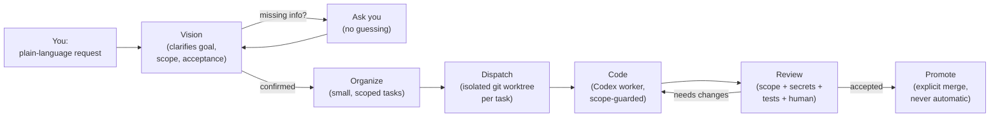

<div align="center">

# VOCR

**Vision · Organize · Code · Review**

A local-first orchestrator that turns a plain-language request into small,
scoped, reviewed changes — never merged until you explicitly say so.

[](https://github.com/JeansBraindead/Codex-VOCR/actions/workflows/ci.yml)
[](LICENSE)
[](pyproject.toml)
[](docs/INSTALLATION.md)

[Quick start](#quick-start) ·
[How it works](#how-it-works) ·
[Safety model](#safety-model) ·
[Normal mode](#normal-mode-the-way-most-people-should-use-vocr) ·
[CLI reference](docs/CLI_REFERENCE.md) ·
[Contributing](CONTRIBUTING.md)

</div>

---

## What is VOCR

VOCR is a local Python MVP built around one idea: an autonomous coding agent
is only trustworthy if the *process around it* is trustworthy. So VOCR wraps
Codex-style AI workers in a strict pipeline — **Vision → Organize → Code →
Review** — where every change is scoped, isolated in its own git worktree,
and gated behind an explicit human review before it can be promoted (merged).

Nothing merges automatically. Nothing executes before you confirm what it's
about to do. That's not a limitation bolted on afterward — it's the whole
point.

VOCR is architecturally inspired by [VOIT](https://github.com/yesitsfebreeze/voit),
particularly the idea of structuring work through clear phases, isolated
worktrees, scope rules, review gates, and promote flows. VOCR is an
independent Python/Codex implementation of those ideas, not a fork or vendored
copy of VOIT.

## Quick start

The safest, simplest path for most people:

```powershell
git clone https://github.com/JeansBraindead/Codex-VOCR.git
cd Codex-VOCR
.\install-vocr.ps1
```

`install-vocr.ps1` creates `.venv` if needed, installs VOCR editable, runs
bootstrap/graphify, and starts normal mode — all idempotently, so re-running
it is always safe. If PowerShell blocks script execution, double-click
`Start-VOCR.bat` instead.

Prefer to do it by hand, or already have the repo cloned into an empty
folder?

```powershell
python -m venv .venv
.\.venv\Scripts\Activate.ps1
pip install -e .
vocr setup
vocr start
```

Full step-by-step instructions (including what to do if PowerShell's
execution policy blocks you, or you have multiple Python versions installed)
are in [`docs/INSTALLATION.md`](docs/INSTALLATION.md).

## How it works



Every task carries its own scope, non-goals, acceptance criteria, and tests.
Workers only ever touch files inside their declared scope — anything outside
it is blocked before commit, and the task is marked `needs_changes`
automatically.

## Safety model

This is the part that matters most, so it gets its own section instead of
being buried in a feature list.

- **Nothing executes without confirmation.** Normal mode always shows a
  summary — goal, scope, acceptance criteria, verification, non-goals,
  execution mode, planned internal steps, safety boundaries — and waits for
  you to say "yes" before creating a single task or worktree.
- **Missing information stays a question, never an assumption.** If your
  request doesn't make goal, scope, acceptance, verification, non-goals, or
  execution bounds clear, VOCR asks — it does not fill in the blank itself.
- **Workers run in isolated git worktrees, never your main branch.** Scope is
  translated into path globs and enforced before commit, not just described
  in a prompt.
- **Review is a real gate.** A task can only be `accepted`, `needs_changes`,
  or `blocked`. Promotion requires an `accepted` review — there is no code
  path that merges without one, including through the MCP server (which
  additionally requires an explicit `confirm=true`).
- **Secrets are scanned, not just trusted.** Every diff — including new
  untracked files — is checked for keyword-style secrets, known token
  patterns, and high-entropy values before `git add`/`git commit`. A match
  blocks the commit without ever printing the secret itself.
- **Repository content is treated as data, not instructions.** Context pulled
  from your repo is wrapped and marked untrusted; a prompt-injection attempt
  hidden in a file cannot override VOCR's own scope or review rules.

The full reasoning — trust boundaries, prompt-injection handling, what the
secret scanner actually checks — is in
[`docs/THREAT_MODEL.md`](docs/THREAT_MODEL.md). The exhaustive list of
design rules the codebase is held to lives in [`AGENTS.md`](AGENTS.md).

## Normal mode: the way most people should use VOCR

```powershell
vocr start
```

This opens a small local Tkinter window — plain Python standard library, no
cloud dependency, no frontend build chain. If no window system is available,
or you'd rather stay in the terminal:

```powershell
vocr start --console
```

You never see task IDs, worktree paths, or dispatch jargon in normal mode.
You just talk:

```
You:  I want a start shell for VOCR.
VOCR: I understand — you want an easier entry point for regular VOCR users.
      Likely relevant areas:
      - src/vocr/cli/app.py
      - a new start/dialog component under src/vocr/ui
      - tests
      - optionally the README/docs

      Proposed acceptance:
      - you can run `vocr start`
      - it opens a normal VOCR dialog
      - no technical clarification codes are shown to you
      - the existing expert CLI flow keeps working

      Verification:
      - python -m compileall src tests
      - python -m unittest discover -s tests

      Non-goals and risks:
      - no changes to review, promote, or worker sandboxing

      Execution bounds:
      - plan first
      - then optionally prepare an isolated workspace
      - never publish automatically
```

Each reply updates exactly one thing at a time — you never have to copy an
ID, pick a clarification number, or type an expert command. Natural
corrections like "sounds good, but skip the docs for now" or "just plan, no
worktree yet" are understood and update the plan before anything executes.

## Optional: local or cloud models

VOCR is Codex-first. Local or cloud models are optional and only assist the
Vision/Organizer paths — Codex worker execution, scope enforcement, review,
and promote remain the actual safety line no matter what model you configure.

```powershell
vocr model lmstudio --model "your-lm-studio-model"
vocr model check --model "your-lm-studio-model"
vocr model status
vocr model off
```

Secrets are never printed — configured API keys always show as `[set]`. If a
local server returns 401, VOCR treats that as "auth is likely on, or your
token is wrong," falls back to the deterministic path, and tells you so
instead of silently pretending it worked.

## Expert / CLI mode

Everything normal mode does under the hood is also directly available:

```powershell
vocr ask "Goal: ... Scope: ... Acceptance: ... Verification: ... Non-goals: ... Execution: plan only, review before promote."
vocr ask "..." --go
vocr work <task-id>
vocr review <task-id>
vocr promote <task-id>
```

The full command surface — model config, graphify/context internals, the
dispatch/work/review/promote pipeline, orchestration, housekeeping, and the
experimental hybrid path — is documented in
[`docs/CLI_REFERENCE.md`](docs/CLI_REFERENCE.md).

## Why VOCR costs less to run

Token efficiency isn't an afterthought — it's engineered in, and it's real
code, not just a claim:

- **Graphify** builds a BM25-ranked, import-graph-aware index of your repo
  once, then serves workers a compact, relevant context brief instead of raw
  file dumps — capped to an explicit token budget, rebuilt incrementally via
  content hashing so unchanged files are never re-processed.
- **Learning overlay** boosts files/scopes that were part of past successful
  reviews directly into that ranking, so recurring work gets cheaper context
  over time.
- **A deterministic, zero-token readiness gate** decides whether a request
  has enough information *before* anything reaches an LLM.
- **Live-agent fan-out is collapsed** to a single structured call instead of
  a chain of specialist-agent hand-offs.
- **Retries send deltas, not full context again.** A fix attempt gets the
  scope, the failing checks, and only the diff lines new since the previous
  attempt — not the full repo context pack a second and third time.

See [`BETA_KICKOFF_REVIEW.md`](BETA_KICKOFF_REVIEW.md) for an honest
assessment of what's proven here versus what's architecturally sound but not
yet benchmarked against a non-tuned baseline.

## Tests

```powershell
python -m compileall src tests
$env:PYTHONPATH="src"; python -m unittest discover -s tests
```

## Where VOCR stores things

- `.vocr/ledger.jsonl` — append-only event/task/review log, local, git-ignored.
- `.vocr/graph.json` — the compact graphify index.
- `.vocr/learning.json` — compressed local signals, never raw prompts or large diffs.
- `.vocr/archive/` — compacted old ledger segments.
- `<repo>.vocr-worktrees/` — isolated per-task worktrees, next to the repo.

## Project status

VOCR is in beta. See [`BETA_KICKOFF_REVIEW.md`](BETA_KICKOFF_REVIEW.md) for
the current readiness assessment and [`docs/BETA_TESTING.md`](docs/BETA_TESTING.md)
for the active test schedule if you're helping test it.

## Contributing

Contributions are welcome — see [`CONTRIBUTING.md`](CONTRIBUTING.md) for dev
setup, conventions, and how the safety gates apply to PRs too.

## Reference and attribution

- Reference architecture: [yesitsfebreeze/voit](https://github.com/yesitsfebreeze/voit).
- VOCR does not vendor any VOIT files; it uses VOIT purely as an architectural
  inspiration for Vision/Organize/Worker/Review/Promote-style flows.
- If VOCR ever adopts VOIT code or assets directly, the relevant license and
  attribution must be documented separately in the affected code path.

## License

[MIT](LICENSE)
