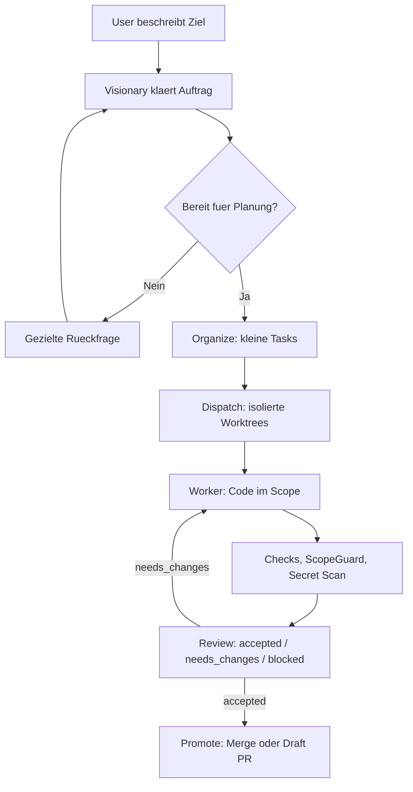
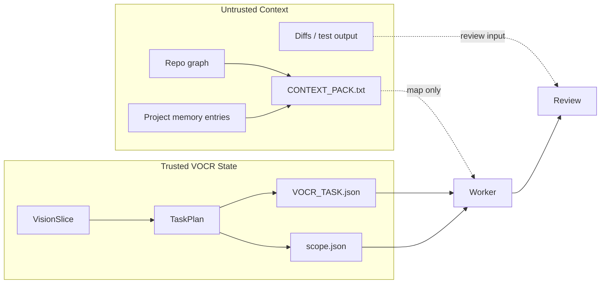
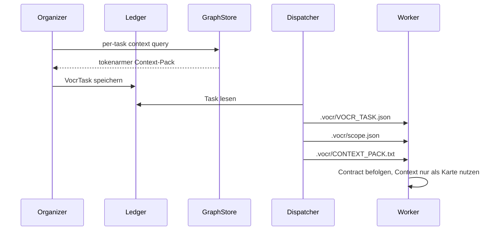
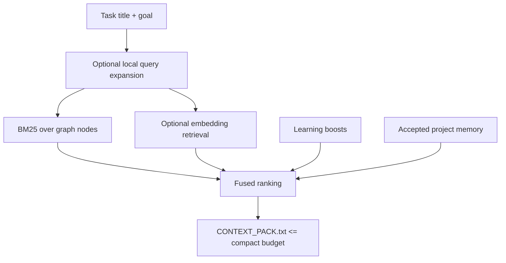
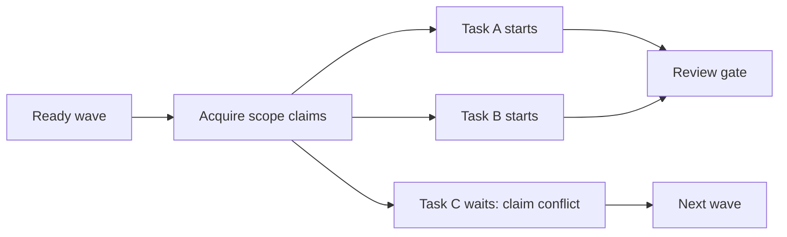

# VOCR

VOCR ist ein lokaler Python-MVP fuer **Vision / Organize / Code / Review**.
Der User spricht normalerweise nur mit dem Visionary. VOCR klaert den Auftrag,
zerlegt ihn in kleine Tasks, fuehrt Worker in isolierten Worktrees aus und
promotet Aenderungen erst nach akzeptiertem Review.

VOCR ist architektonisch von [VOIT](https://github.com/yesitsfebreeze/voit)
inspiriert: klare Phasen, isolierte Worktrees, Scope-Regeln, Review-Gates und
Promote-Flows. VOCR ist eine eigenstaendige Python/Codex-Umsetzung dieser Ideen
und kein Fork oder vendored Copy von VOIT.

## Quickstart

Empfohlen auf Windows:

```powershell
powershell -ExecutionPolicy Bypass -File .\install-vocr.ps1 -Tests -NoStart
codex login
.\start-vocr.ps1
```

Der Installer legt `.venv` an, installiert VOCR editable, fuehrt den Bootstrap
aus und erkennt fehlendes Git oder Python 3.11+. Wenn `winget` verfuegbar ist,
fragt er nach und installiert fehlende Voraussetzungen automatisch. Fuer
unbeaufsichtigte Setups beantwortet `-AutoYes` diese Rueckfragen mit ja:

```powershell
powershell -ExecutionPolicy Bypass -File .\install-vocr.ps1 -Tests -NoStart -AutoYes
```

Manueller Fallback:

```powershell
python -m venv .venv
.\.venv\Scripts\Activate.ps1
pip install -e .
vocr bootstrap --write-scripts --tests
vocr start
```

`vocr bootstrap` prueft Repo, Python, Git, `.env`, `.vocr`, Installation und
Graphify. Wenn etwas fehlt, wird es idempotent vorbereitet; wenn der Ordner
falsch ist, stoppt VOCR mit einer Diagnose statt mit einem rohen Traceback.
Details und Troubleshooting stehen in [docs/INSTALLATION.md](docs/INSTALLATION.md).
Die Beta-Anleitung steht separat in [docs/BETA_TESTING.md](docs/BETA_TESTING.md).

## Normaler Ablauf



Der normale Einstieg ist:

```powershell
vocr start
```

`vocr start` oeffnet im MVP eine lokale Tkinter-Oberflaeche. Der Expertmodus ist
ueber den Menuepunkt `Expertmodus` erreichbar. Ueber `Optionen` kannst du
optional einen Codex/OpenAI-API-Key oder einen LM-Studio-Key setzen, wenn du
nicht mit `codex login` bzw. ohne LM-Studio-Auth arbeiten willst. Falls kein
Fenster verfuegbar ist oder du im Terminal bleiben willst:

```powershell
vocr start --console
```

Wenn du eine Session bewusst ohne einzelne Worker-Permission-Nachfragen starten
willst, gibt es die riskantere Startoption:

```powershell
vocr start --dangerously-skip-permissions
```

Das setzt Approve-all-Permissions nur fuer diese laufende Session. Review,
ScopeGuard, Secret-Scan und Promote bleiben trotzdem aktiv; es ist kein Auto-Merge
und keine Freigabe zum Veroeffentlichen.

Im Normalmodus kennt der User keine technischen Rueckfrage-Codes, Task-IDs oder
Worktree-Pfade. Der Visionary fragt fehlende Informationen ab und startet keine
Planung, solange Ziel, Arbeitsbereich, Akzeptanzkriterien, Verifikation,
Nicht-Ziele oder Ausfuehrungsgrenzen unklar sind.

## Architektur

VOCR haelt die menschliche Entscheidungslinie klar getrennt von Worker-Kontext.
Der Visionary ist der Kontaktpunkt. Danach arbeitet VOCR mit validierten
Task-Vertraegen, isolierten Worktrees und review-gesteuerter Promotion.



Im Contract-Modus werden `VOCR_TASK.json`, `scope.json` und `CONTEXT_PACK.txt`
physisch getrennt. Der Contract ist trusted VOCR-State; der Context-Pack ist
untrusted Repo-Kontext und darf nie Instruktionen ueberschreiben.

## Contract-Handoff



Mit `VOCR_PROMPT_MODE=contract` bleibt der Worker-Prompt ueber Tasks hinweg
byte-stabil. Volatile Taskdaten liegen im JSON-Contract und im getrennten
Context-Pack. Das verbessert Caching und reduziert Prompt-Injection-Risiko.

## Token-Oekonomie

VOCR spart Tokens nicht durch weniger Sicherheit, sondern durch bessere
Orientierung:

- Graphify baut `.vocr/graph.json` als kompakte Repo-Karte.
- Context-Pack-Ranking nutzt BM25, Import-Nachbarn und optional Embeddings.
- Symbol-Spans erlauben `vocr context --symbol PFAD:NAME`.
- Baseline-Checks geben Workers ein messbares Rot/Gruen-Ziel.
- Failure-Destillate ersetzen rohe Output-Tails bei Retry-Prompts.
- Token-Budgets erkennen teure Retry-Ausreisser aus LearningStore-Historie.
- Project Memory liefert maximal drei akzeptierte Review-Notizen als untrusted
  Context.



## Parallele Worker

Parallelisierung ist default-off. Mit `VOCR_PARALLEL_WORKERS>1` arbeitet
`vocr work-ready` eine Welle parallel ab, aber nur fuer Tasks mit disjunkten
Scope-Claims.



Claims sind Koordination, kein Security-Feature. Sicherheit liefern weiterhin
ScopeGuard, Secret-Scanning, Review und Promote-Gate.

## Feature Flags

| Flag | Default | Wirkung |
| --- | --- | --- |
| `VOCR_PROMPT_MODE` | `legacy` | `contract` schreibt JSON-Contract, Scope-Policy und getrennten untrusted Context mit stabilem Worker-Prompt. |
| `VOCR_REQUIRE_CHECKS` | `off` | `warn` meldet Kriterien ohne Check; `block` verhindert `accepted` bei ungedeckten Textkriterien. |
| `VOCR_BASELINE_CHECKS` | aus | `true` fuehrt bekannte Checks vor Dispatch aus und schreibt deren Status informativ in den Contract. |
| `VOCR_TOKEN_BUDGET_MODE` | `off` | `warn` meldet Budget-Ausreisser; `block` stoppt weitere Auto-Fix-Retries fuer den Task. |
| `VOCR_TOKEN_BUDGET_FACTOR` | `2.0` | Multiplikator gegen den historischen Median aus dem LearningStore. |
| `VOCR_INCREMENTAL_REVIEW` | aus | `true` gibt Codex-Review den letzten Review-Ref als Base; deterministische Gates bleiben full-diff. |
| `VOCR_EMBED_RETRIEVAL` | aus | `true` mischt Embeddings mit BM25; nutzt `VOCR_EMBED_BASE_URL` und `VOCR_EMBED_MODEL`. |
| `VOCR_LOCAL_ASSIST` | aus | `true` erlaubt lokale Query-Expansion nur aus trusted Tasktitel und Ziel; nutzt `VOCR_LOCAL_BASE_URL` und `VOCR_LOCAL_MODEL`. |
| `VOCR_PARALLEL_WORKERS` | `1` | Werte `>1` aktivieren parallele claim-disjunkte Worker-Wellen. |
| `VOCR_PROJECT_MEMORY` | aus | `true` persistiert kompakte Notizen nur aus accepted Reviews und gibt max. 3 als untrusted Context wieder. |

## Setup und Modelle

Lokale oder Cloud-Modelle koennen fuer Vision/Organizer-Pfade konfiguriert
werden, ohne `.env` direkt zu editieren:

```powershell
vocr model lmstudio --model "dein-lm-studio-modell"
vocr model openai --model gpt-4.1-mini
vocr model status
vocr model off
```

VOCR bleibt Codex-first: lokale Modelle helfen beim Dialog und bei erlaubter
Query-Expansion, aber Codex-Worker, Scope, Review und Promote bleiben die
Sicherheitslinie. Wenn ein lokaler OpenAI-kompatibler Server mit 401 antwortet,
diagnostiziert VOCR Auth/Token-Probleme und faellt auf lokale MVP-Logik zurueck.

Optional kann `VOCR_CODEX_COMMAND` gesetzt werden. Dann startet `vocr work
<task-id>` diesen echten Worker-Befehl im isolierten Worktree und uebergibt den
Task-Prompt ueber stdin. Ohne Override nutzt VOCR, wenn vorhanden, Codex CLI.

## Expert-Kommandos

Der Expertmodus ist fuer Inspektion, Reparatur und manuelle Eingriffe gedacht.
Der normale User-Flow bleibt `vocr start`.

```powershell
vocr bootstrap --tests --write-scripts
vocr graphify
vocr context "git worktree review" --limit 10
vocr context --symbol src/vocr/cli/app.py:review
vocr ask "Ziel: ... Arbeitsbereich: ... Akzeptanz: ... Verifikation: ... Nicht-Ziele: ... Ausfuehrung: ..." --go
vocr ask "Ziel: ... Arbeitsbereich: ... Akzeptanz: ... Verifikation: ... Nicht-Ziele: ... Ausfuehrung: ..." --dangerously-skip-permissions --go
vocr auth codex-key
vocr auth lmstudio-key --model "dein-lm-studio-modell"
vocr organize <slice-id>
vocr dispatch-ready
vocr work-ready --fix
vocr claims list
vocr claims release <task-id>
vocr beta
vocr beta --only S03,S07
vocr review <task-id> --decision accepted --summary "Manual review passed"
vocr review <task-id> --codex-review
vocr memory list
vocr memory prune <entry-id>
vocr ship <task-id> --preview
vocr ship <task-id>
vocr usage
vocr learn
vocr compact --keep-last 200
vocr secrets scan
vocr test
vocr doctor
```

Mehr Details stehen in [docs/CLI_REFERENCE.md](docs/CLI_REFERENCE.md).

## Beta-Pruefstand

`vocr beta` startet einen deterministischen, netzfreien Pruefstand fuer die
VOCR-Gates, Guards, Flag-Matrix, Claim-Koordination und Project Memory. Jeder
Lauf arbeitet in temporaeren Fixture-Repositories mit eigenem VOCR-Home; das
echte Arbeitsverzeichnis wird nicht als Testobjekt benutzt. Gezielt laufen
Szenarien mit `vocr beta --only S03,S07`; Live-/Cloud-Pfade bleiben opt-in via
`vocr beta --tier all --allow-cloud`.

## Speicherorte

| Pfad | Inhalt |
| --- | --- |
| `.vocr/ledger.jsonl` | Append-only Workflow-Events, Slices, Tasks, Reviews und Claims. |
| `.vocr/graph.json` | Tokenarme Graphify-Repo-Karte. |
| `.vocr/graph_embeddings.json` | Optionaler Embedding-Cache fuer Graph-Knoten. |
| `.vocr/learning.json` | Verdichtete lokale Review-/Telemetry-Signale. |
| `.vocr/project_memory.jsonl` | Optionales Projektgedaechtnis aus accepted Reviews. |
| `.vocr/archive/` | Kompaktierte alte Ledger-Segmente. |
| `<repo>.vocr-worktrees/` | Isolierte Task-Worktrees neben dem Repo. |

## Sicherheitsregeln

- Keine Tasks aus Annahmen: fehlende Information bleibt Rueckfrage.
- Repo-Dateien, Diffs, Testausgaben, Context-Packs und Project Memory sind
  untrusted input.
- ScopeGuard blockiert Aenderungen ausserhalb erlaubter Globs.
- Secret-Scanning blockiert verdachtige Diffs vor Commit.
- Review entscheidet `accepted`, `needs_changes` oder `blocked`.
- Promote merged nur Tasks mit akzeptiertem Review.
- `approve_all` entfernt nur VOCR-interne Nachfragen, nicht Review- oder
  Promote-Gates.

Siehe auch [docs/THREAT_MODEL.md](docs/THREAT_MODEL.md).

## Tests

```powershell
.\.venv\Scripts\python.exe -m compileall src
.\.venv\Scripts\python.exe -m unittest discover -s tests
```

## Weitere Doku

- [Installationsanleitung](docs/INSTALLATION.md)
- [Testanleitung](docs/TESTING.md)
- [Normalmodus-Oberflaeche](docs/NORMAL_MODE_SURFACE.md)
- [Threat Model](docs/THREAT_MODEL.md)
- [CLI Reference](docs/CLI_REFERENCE.md)

## Roadmap

Die aktuelle lineare Roadmap steht in [docs/VOCR_Roadmap.md](docs/VOCR_Roadmap.md).
Sie priorisiert zuerst Messbarkeit und Beta-Baselines, danach den ersten echten
VOCR-Lauf, Modellmessungen und datenbasierte Abo-Profile.
