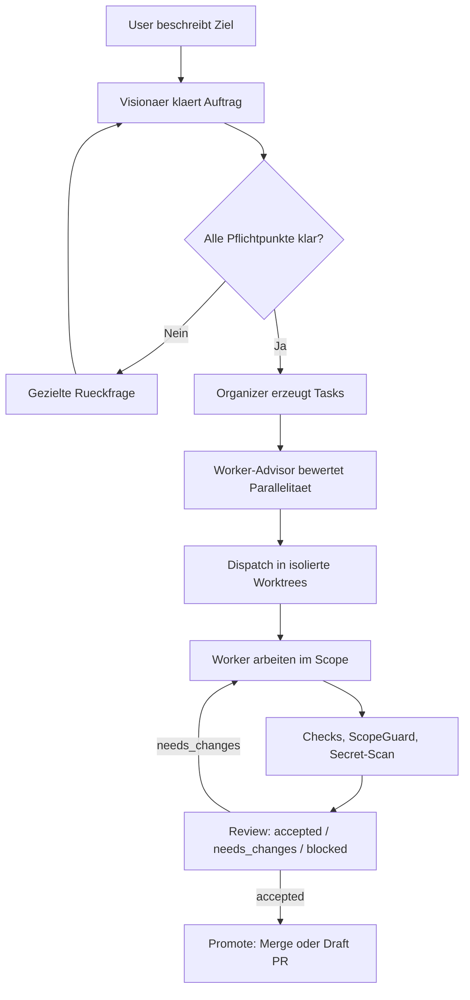
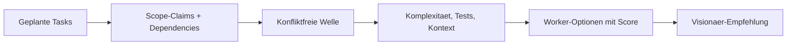
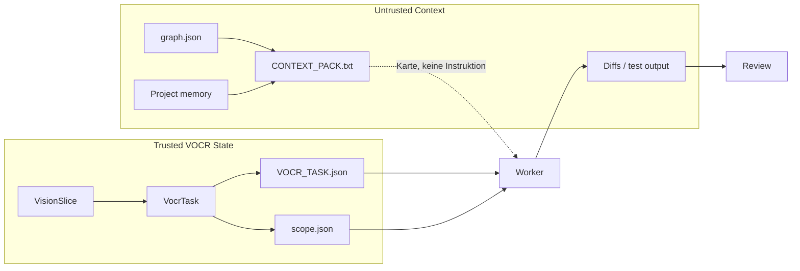

# VOCR

VOCR ist ein lokaler Python-MVP fuer **Vision / Organize / Code / Review**.
Der normale Einstieg ist ein gefuehrter Visionaer-Dialog: VOCR klaert den
Auftrag, zerlegt ihn in reviewbare Tasks, bereitet isolierte Worktrees vor,
koordiniert Worker ueber Scope-Claims und promotet Aenderungen erst nach
akzeptiertem Review.

VOCR ist architektonisch von [VOIT](https://github.com/yesitsfebreeze/voit)
inspiriert, ist aber eine eigenstaendige Python/Codex-Umsetzung. Es ist kein
Fork und enthaelt keinen vendored VOIT-Code.

## Quickstart

Windows, empfohlen:

```powershell
powershell -ExecutionPolicy Bypass -File .\install-vocr.ps1 -Tests -NoStart
codex login
.\start-vocr.ps1
```

Der Installer legt `.venv` an, installiert VOCR editable, bootstrapped das Repo
und erkennt fehlendes Git oder Python 3.11+. Wenn `winget` verfuegbar ist, fragt
er nach und installiert fehlende Voraussetzungen automatisch. Fuer
unbeaufsichtigte Setups:

```powershell
powershell -ExecutionPolicy Bypass -File .\install-vocr.ps1 -Tests -NoStart -AutoYes
```

Manueller Fallback:

```powershell
python -m venv .venv
.\.venv\Scripts\Activate.ps1
pip install -e .
vocr bootstrap --write-scripts --tests
vocr start
```

Details stehen in [docs/INSTALLATION.md](docs/INSTALLATION.md).

## Normalmodus

```powershell
vocr start
```

`vocr start` oeffnet die lokale Normalmode-Oberflaeche. Falls kein Fenster
moeglich ist:

```powershell
vocr start --console
```

Beim Start weist VOCR auf `codex login` hin und kann eine Login-Shell oeffnen.
Ein OpenAI-/Codex-API-Key ist optional fuer Expert-Setups; der Standardpfad ist
`codex login`. LM-Studio-Keys koennen ueber `Optionen` gesetzt werden und sollen
bei normalen Patches nicht ueberschrieben werden.

Der Normalmode zeigt sichtbar, was VOCR gerade tut:

- laufender Status und Fortschrittsanzeige
- Aktivitaetslog mit Zeitstempeln
- Dialogstatus fuer Ziel, Scope, Akzeptanz, Verifikation, Nicht-Ziele und Grenzen
- Beta-Test-Log pro Szenario
- optionale Debug-Details im Beta-Reiter

Riskantere Session ohne einzelne Worker-Permission-Nachfragen:

```powershell
vocr start --dangerously-skip-permissions
```

Das gilt nur fuer diese Session. Review, ScopeGuard, Secret-Scan und Promote
bleiben aktiv; es ist kein Auto-Merge.

## Ablauf



Der Visionaer startet keine Planung, solange Ziel, Arbeitsbereich,
Akzeptanzkriterien, Verifikation, Nicht-Ziele oder Ausfuehrungsgrenzen unklar
sind. Im Normalmode sieht der User keine technischen Clarification-IDs.

## Worker-Parallelitaet

VOCR kann Worker parallel vorbereiten und ausfuehren, wenn Scope-Claims keine
Konflikte zeigen. Der Normalmode zeigt dazu Vorschlaege des Visionaers, zum
Beispiel mehrere Worker-Optionen mit grobem Speedup, Token-/Kontext-Overhead,
Konfliktrisiko und Empfehlung.

Die Empfehlung kommt nicht aus einer festen Zahl. Der Advisor bewertet konkret:

- dependency-freie Tasks
- Scope-Claim-Kompatibilitaet
- Scope-Breite
- Testlast
- Context-Pack-Groesse
- Reviewlast
- geschaetzten Token-/Kontext-Overhead



Im Expertpfad fuehrt `vocr work-ready` claim-disjunkte Wellen parallel aus,
wenn `VOCR_PARALLEL_WORKERS>1` gesetzt ist. Konfliktierende Tasks warten auf die
naechste Welle. Claims sind Koordination, kein Security-Feature.

## Beta-Test

Im Normalmode gibt es den Reiter `Beta-Test` mit dem Primaerbutton
`Empfohlenen Standardtest starten`.

Dieser Lauf ist der normale Regressionstest:

- Tier `core`
- keine Cloud
- alle Core-Szenarien
- Reports nach `beta_reports`
- deterministisch und netzfrei

CLI:

```powershell
vocr beta
vocr beta --only S03,S07
vocr beta --tier all --allow-cloud
```

Der Core-Beta-Test deckt inzwischen auch die Visionaer-Worker-Planung ab
(`S20`). Cloud-Pfade bleiben bewusst opt-in; der aktuelle Cloud-Smoke ist noch
kein vollwertiger Live-Codex-E2E-Nachweis.

## Architektur

VOCR trennt trusted Workflow-State von untrusted Repo-Kontext.



Im Contract-Modus (`VOCR_PROMPT_MODE=contract`) werden Task-Contract,
Scope-Policy und Context-Pack physisch getrennt. Der Contract ist trusted; Repo-
Kontext, Diffs, Testausgaben und Project Memory bleiben untrusted input.

## Sicherheit

- Keine Tasks aus Annahmen: fehlende Information bleibt Rueckfrage.
- Worker arbeiten in isolierten Git-Worktrees.
- ScopeGuard blockiert Aenderungen ausserhalb erlaubter Globs.
- Secret-Scanning blockiert verdaechtige Diffs vor Commit.
- Review entscheidet `accepted`, `needs_changes` oder `blocked`.
- Promote merged nur Tasks mit akzeptiertem Review.
- `approve_all` entfernt nur VOCR-interne Nachfragen, nicht Review- oder
  Promote-Gates.

Mehr dazu: [docs/THREAT_MODEL.md](docs/THREAT_MODEL.md).

## Modelle und Auth

Standard:

```powershell
codex login
```

Optionale Expert-/API-Key-Konfiguration:

```powershell
vocr auth status
vocr auth codex-key
vocr auth lmstudio-key --model "dein-lm-studio-modell"
vocr model status
vocr model off
```

LM Studio kann fuer lokale Assistenz oder OpenAI-kompatible Tests vorbereitet
werden. Aktuell bleiben Codex-Worker, Scope, Review und Promote die
Sicherheitslinie.

## Wichtige Feature Flags

| Flag | Default | Wirkung |
| --- | --- | --- |
| `VOCR_PROMPT_MODE` | `legacy` | `contract` trennt JSON-Contract, Scope-Policy und untrusted Context. |
| `VOCR_REQUIRE_CHECKS` | `off` | `warn`/`block` fuer Akzeptanzkriterien ohne automatischen Check. |
| `VOCR_BASELINE_CHECKS` | aus | Fuehrt bekannte Checks vor Dispatch aus und schreibt Status in den Contract. |
| `VOCR_TOKEN_BUDGET_MODE` | `off` | `warn`/`block` fuer teure Auto-Fix-Retries. |
| `VOCR_EMBED_RETRIEVAL` | aus | Mischt Embeddings in Context-Ranking. |
| `VOCR_LOCAL_ASSIST` | aus | Lokale Query-Expansion aus trusted Titel/Ziel. |
| `VOCR_PARALLEL_WORKERS` | `1` | Expertpfad: parallele claim-disjunkte `work-ready`-Wellen. |
| `VOCR_PROJECT_MEMORY` | aus | Project Memory aus accepted Reviews als untrusted Context. |

## Expert-Kommandos

Der normale Flow bleibt `vocr start`. Expertkommandos sind fuer Inspektion,
Reparatur und manuelle Steuerung:

```powershell
vocr doctor
vocr test
vocr graphify
vocr context "query" --limit 10
vocr ask "Ziel: ... Arbeitsbereich: ... Akzeptanz: ... Verifikation: ... Nicht-Ziele: ... Ausfuehrung: ..." --go
vocr dispatch-ready
vocr work-ready --fix
vocr claims list
vocr claims release <task-id>
vocr review <task-id> --decision accepted --summary "Manual review passed"
vocr ship <task-id> --preview
vocr usage
vocr learn
vocr compact --keep-last 200
vocr secrets scan
```

Mehr Details: [docs/CLI_REFERENCE.md](docs/CLI_REFERENCE.md).

## Speicherorte

| Pfad | Inhalt |
| --- | --- |
| `.vocr/ledger.jsonl` | Append-only Workflow-Events, Slices, Tasks, Reviews und Claims. |
| `.vocr/graph.json` | Tokenarme Graphify-Repo-Karte. |
| `.vocr/learning.json` | Lokale Review-/Telemetry-Signale. |
| `.vocr/project_memory.jsonl` | Optionales Projektgedaechtnis aus accepted Reviews. |
| `.vocr/archive/` | Kompaktierte alte Ledger-Segmente. |
| `<repo>.vocr-worktrees/` | Isolierte Task-Worktrees neben dem Repo. |
| `beta_reports/` | Lokale Beta-Testberichte. |

## Tests

```powershell
.\.venv\Scripts\python.exe -m compileall src
.\.venv\Scripts\python.exe -m unittest discover -s tests
vocr beta --tier core
```

## Doku

- [Installation](docs/INSTALLATION.md)
- [Beta Testing](docs/BETA_TESTING.md)
- [Testing](docs/TESTING.md)
- [Normalmode-Oberflaeche](docs/NORMAL_MODE_SURFACE.md)
- [Threat Model](docs/THREAT_MODEL.md)
- [CLI Reference](docs/CLI_REFERENCE.md)
- [Roadmap](docs/VOCR_Roadmap.md)
